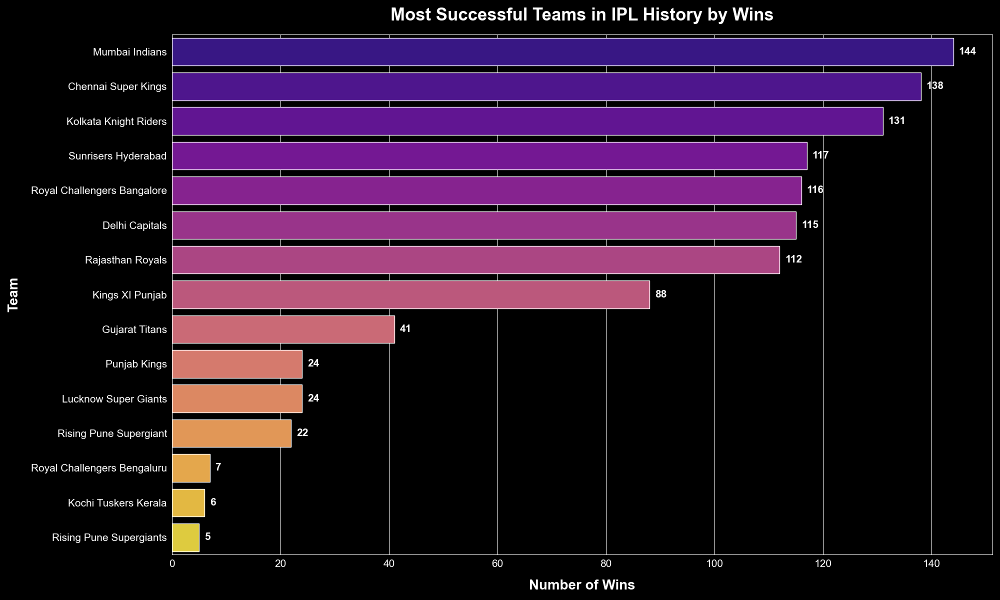
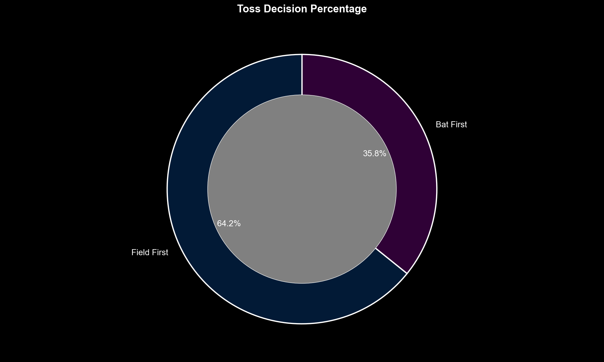
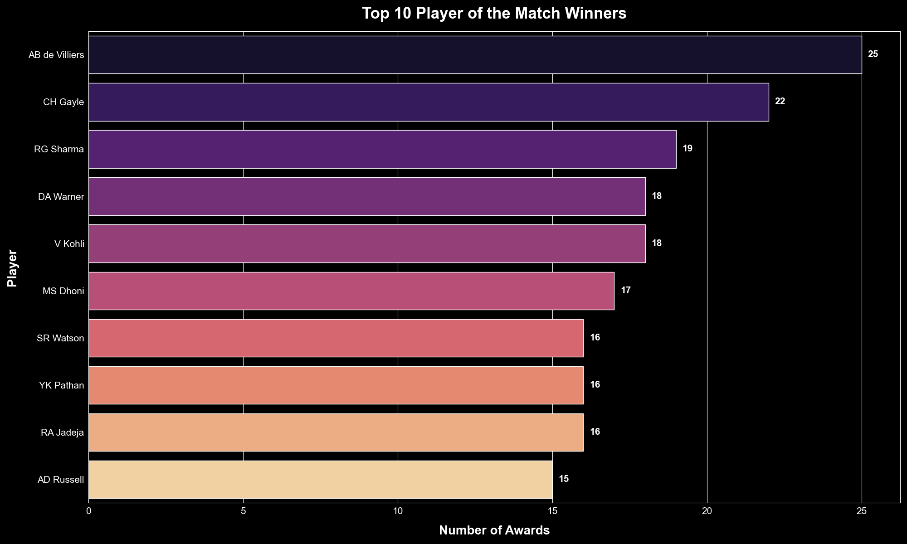
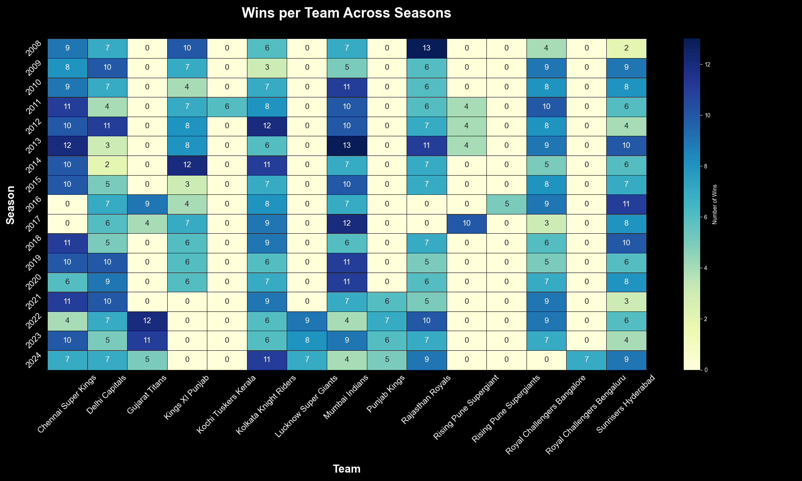

# Indian Premier League (IPL) Cricket Match Analysis 🏏

**This project performs a comprehensive data analysis of the Indian Premier League (IPL) from its inaugural season in 2008 to 2024. By dissecting match-level and ball-by-ball data, this analysis uncovers key trends, player statistics, and strategic insights that define success in the world's premier T20 cricket league.**

---

## 📋 Table of Contents

1.  [Problem Statement](#-problem-statement)
2.  [Tech Stack](#-tech-stack)
3.  [Project Structure](#-project-structure)
4.  [How to Run This Project](#-how-to-run-this-project)
5.  [Key Findings & Visualizations](#-key-findings--visualizations)
6.  [Conclusion](#-conclusion)

---

## 🎯 Problem Statement

The core objective of this analysis is to answer the question:

> **"What are the most significant statistical factors and strategies that contribute to winning an IPL match?"**

This involves analyzing the impact of the toss, identifying dominant teams, and pinpointing the most valuable players.

---

## 🛠️ Tech Stack

- **Python:** The core programming language for the analysis.
- **Pandas:** Used for data manipulation, cleaning, and exploration.
- **Matplotlib & Seaborn:** Used for creating high-quality, insightful visualizations.
- **Jupyter Notebook:** The interactive environment for writing and presenting the analysis.

---

## 📂 Project Structure

The project repository is organized in a clean and professional manner as follows:

**`📂Indian-Premier-League-IPL-Cricket-Match-Analysis/`**
-    `📂 sample_datasets/`                 # Contains the raw datasets
|   |-- matches.csv
|   |-- deliveries.csv
-    `📂 cleaned_datasets/`         # Contains the cleaned datasets
|   |-- matches_cleaned.csv
|   |-- deliveries_cleaned.csv
-    `📂notebooks/`
📄 IPL_Analysis.ipynb    # The complete Jupyter Notebook with all the code
-    `📂 visualizations/`       # Contains all the saved charts and graphs
|   |-- (10+ .png files)
-- 📄 .gitignore             # Specifies files for Git to ignore
-- 📄 README.md             # This project overview file


---

## 🚀 How to Run This Project

To replicate this analysis on your local machine, follow these steps:

1.  **Clone the Repository:**
    ```bash
    git clone [https://github.com/](https://github.com/)[Your-Username]/IPL-Analysis-Project.git
    cd IPL-Analysis-Project
    ```
2.  **Create a Virtual Environment (Recommended):**
    ```bash
    python -m venv venv
    source venv/bin/activate  # On Windows, use `venv\Scripts\activate`
    ```
3.  **Install the Required Libraries:**
    ```bash
    pip install pandas matplotlib seaborn notebook
    ```
4.  **Launch Jupyter Notebook:**
    ```bash
    jupyter notebook
    ```
5.  **Open the Notebook:** In the Jupyter interface that opens in your browser, navigate to and open `IPL_Analysis.ipynb`. You can then run the cells to see the analysis execute from start to finish.

---

## ✨ Key Findings & Visualizations

### 1. The Dynasties of the IPL

A clear hierarchy exists, with **Mumbai Indians** and **Chennai Super Kings** standing out as the most successful franchises in the league's history.



### 2. The "Chase to Win" Strategy

Captains overwhelmingly prefer to **field first** after winning the toss, indicating a strong strategic belief in chasing a target under pressure.



### 3. The Match-Winning Icons

A small group of elite players, led by legends like **AB de Villiers** and **Chris Gayle**, have the highest impact, consistently winning the "Player of the Match" award.



### 4. Team Performance Across Seasons

The heatmap provides a clear visual of team consistency, showing how dominant teams maintain high win counts year after year.



---

## 🏁 Conclusion

Winning in the IPL is not a matter of luck but a result of a clear, data-backed formula:

* **Strategic Chasing:** Teams that win the toss and choose to field have a strategic edge.
* **Core Champions:** Success is built around a consistent core of high-impact, elite players.
* **Specialist Supremacy:** The most valuable players are specialists who excel in their specific roles (batting or bowling).

This analysis demonstrates that a deep understanding of data can reveal the patterns that define victory in high-stakes T20 cricket.

---
*(Remember to replace `[Your-Username]` with your actual GitHub username in the "How to Run This Pr


---

## 👨‍💻 Author

-   **Name:** Sahil Kesharwani

---